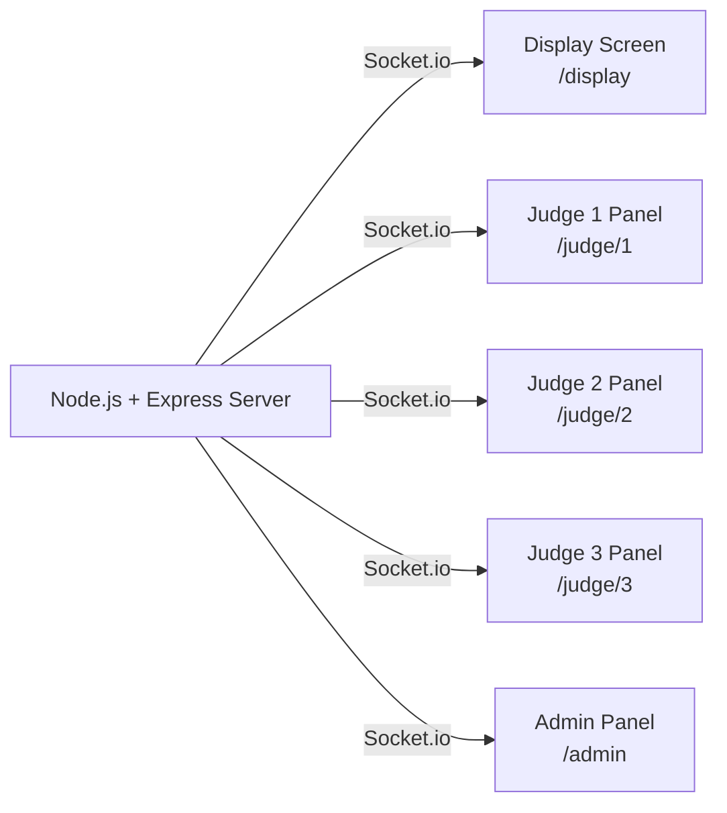

# Hirustar Reality Singing Show — Live Scoreboard System

A real-time, TV-ready scoring system for a reality singing show with a live display screen and separate judge/admin control panels, all synced via WebSockets.

---

## Architecture Overview



- **Backend**: Node.js + Express + Socket.io
- **Storage**: In-memory (server-side JS object) — no database needed
- **Contestant/Judge data**: Defined in a `data.js` config file (names, images, starting scores)
- **Real-time sync**: All windows connected via Socket.io — score changes broadcast instantly

---

## Screens

### 1. `/display` — TV Broadcast Screen
- Fullscreen, designed for a large monitor/projector
- **Left 50%**: `Grig Sparks BG.mp4` looping video, completely empty (for overlays or camera feed)
- **Right 50%**: Live scoreboard
  - Contestants ordered highest → lowest score
  - Each row: Contestant photo, name, score
  - **Score animation**: When a +7 arrives, the judge's image + "+7" badge floats in, then the score updates, then the rows smoothly reorder
- Semi-transparent dark panel overlaid on the right side for readability against the video BG

### 2. `/judge/1`, `/judge/2`, `/judge/3` — Judge Panels
- One per judge (3 separate URLs, can be opened on tablets/phones/laptops)
- Shows judge's own name/photo at the top
- Lists all contestants with their **current score**
- One **+7** button per contestant
  - Button is **disabled after one click** to prevent double-scoring (can be reset by admin)
- Live score updates reflected here too

### 3. `/admin` — Admin Control Panel
- Shows all contestants + scores (same as judge panel)
- Has **+7 for all 3 judges** per contestant (for manual override)
- Has a **Reset Round** button to re-enable all +7 buttons for judges
- Can also manually edit scores directly

---

## Proposed File Structure

```
f:\Data\Yvexa\Projects\Hirustar Score Set\
├── server.js              # Express + Socket.io server
├── package.json
├── data.js                # Contestant & judge config (names, images, start scores)
├── public\
│   ├── Grig Sparks BG.mp4 # (already exists)
│   ├── images\
│   │   ├── contestants\   # contestant photos
│   │   └── judges\        # judge photos
│   ├── display.html       # TV broadcast screen
│   ├── judge.html         # Judge panel (parameterized by judge ID)
│   ├── admin.html         # Admin control panel
│   └── style.css          # Shared styles
```

---

## Data Config (`data.js`)

```js
// Predefined contestants (5–12)
contestants: [
  { id: 1, name: "Aria Patel",    image: "aria.jpg",    score: 0 },
  { id: 2, name: "Leo Cruz",      image: "leo.jpg",     score: 0 },
  // ... up to 12
]

// 3 judges
judges: [
  { id: 1, name: "Judge Ravi",   image: "ravi.jpg" },
  { id: 2, name: "Judge Meera",  image: "meera.jpg" },
  { id: 3, name: "Judge Sam",    image: "sam.jpg" },
]
```

---

## Real-time Flow

```
Judge clicks +7 on their panel
  → emits `add_score` event with { contestantId, judgeId }
  → Server updates score in memory
  → Server broadcasts `score_update` to ALL clients: { contestantId, judgeId, newScore, delta: +7 }
  → Display screen animates: judge image floats in → score ticks up → rows reorder smoothly
  → All judge panels update the live score numbers
```

---

## Animation Plan (Display Screen)

1. **Score pop-in**: Judge's circular photo + "+7" badge slides in from the right onto the contestant's row (1.5s)
2. **Score counter**: Ticks up from old → new score (0.5s)
3. **Row reorder**: CSS-animated smooth vertical repositioning after score settles (0.8s)
4. All transitions use CSS `transition` + `transform` with JS-managed absolute positioning for smooth reorder

---

## Open Questions

> [!IMPORTANT]
> **Contestant Photos**: Do you have actual photos for contestants and judges, or should I use generated placeholder avatars initially? (Easy to swap later)

> [!IMPORTANT]
> **Contestant Names**: Can you give me the actual names of the 5–12 contestants and 3 judges? Or should I use placeholder names that you can edit in `data.js` yourself?

> [!IMPORTANT]
> **Starting Scores**: Should all contestants start at 0, or do some come in with pre-existing scores (e.g., from earlier rounds)?

> [!NOTE]
> **Judge Panel Locking**: Once a judge clicks +7 for a contestant, should that button lock for the entire show, or just until the admin resets for the next round?

> [!NOTE]
> **Network Setup**: All windows need to be on the same local network, connecting to the server PC's IP. I'll make the server easy to configure for this.

---

## Verification Plan

- Run `node server.js` to start the server
- Open `/display` on the broadcast monitor (fullscreen)
- Open `/judge/1`, `/judge/2`, `/judge/3` on separate devices or browser windows
- Click +7 on a judge panel → verify display screen animates and reorders correctly
- Open `/admin` to verify override controls work
